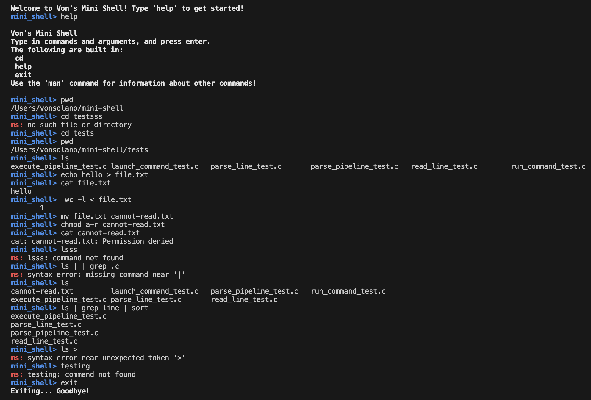

# 🐚 Mini Shell

Lightweight Unix-style mini shell written in C, designed to replicate basic shell functions!

---

## 📸 Screenshot

---

## ✅ Features
- **Command Execution:**
    Runs standard Unix commands with arguments (e.g. 'echo hello world', 'ls -l')
- **Builtin Commands:**
    Supports 'cd', 'exit', and 'help'
- **Input/Output Redirection:**
    Use '<' and '>' to redirect stdin and stdout
- **Coloured Prompts:**
    Custom coloured 'mini-shell>' prompt for enhanced UX
- **Modular Design:**
    Seperated functions into clean C module ('parse_line', 'run_command', 'handle_redirection')

---

## 🛠️ Compilation
1. make
2. ./mini-shell

---

## 📚 Future Improvements
- **Implement Pipelines:** Execute chained commands using Unix pipes (|)
- **Background Execution:** Manage background jobs (&)
- **Tab Completion:** Autocomplete commands and filenames for better UX
- **Signal Handling:** Handle signals such as SIGINT and SIGSTP

